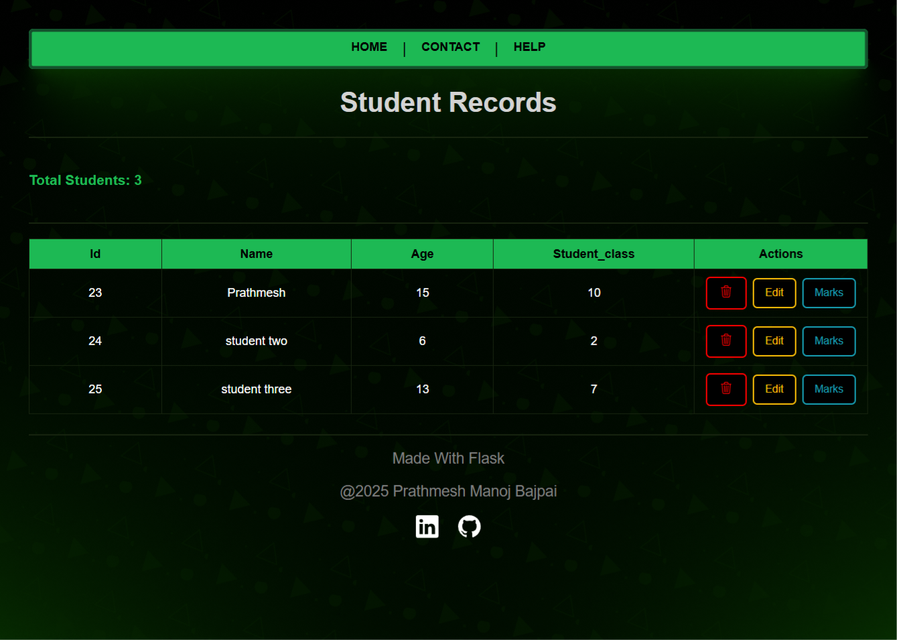
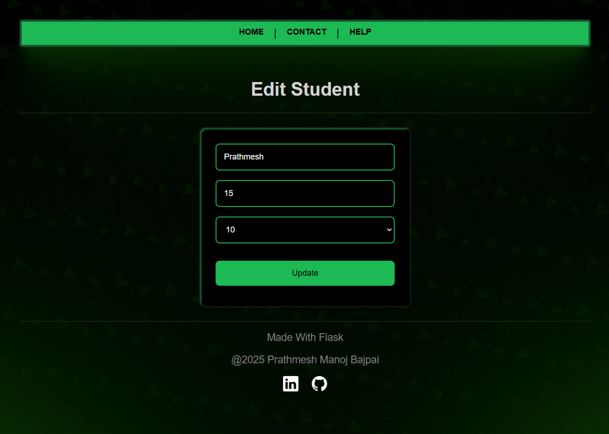

# Student Database Management System (Flask + MySQL)

A web-based Student Result Management System built using **Flask** and **MySQL** that allows users to add students, assign marks, and view data in a tabular and graphical format.

---

## Features

This project is designed to demonstrate mastery of SQL CRUD operations using Flask, MySQL, MySQL Workbench, HTML and CSS.

---

Create:
 - Add new student records and their subject-wise marks to the database

Read:
  - View all students and their marks, both in tabular and graphical format

Update:
  - Edit student information and update marks for individual subjects

Delete:
  - Remove student entries and specific marks from the system

📊 Graphical Analysis:
  - View student marks as bar charts using Chart.js

MySQL Integration:
  - Robust backend connected with relational DB and foreign keys

Clean UI:
  - Frontend built using Bootstrap for responsiveness and clarity

Deployment Ready:
  - Runs locally with full DB support and deployable (Render-safe fallback logic)


---

## 📷 Screenshots

### 🏠 Home Page


### 📋 Student List


### ✏️ Student edit


### 📊 Marks Chart View & Edit


---

## 🎬 Video Demo

[▶️ Click to Watch Demo on YouTube](https://www.youtube.com/watch?v=YOUR_VIDEO_LINK)

> Or embed it below:

```html
<a href="https://www.youtube.com/watch?v=[YOUR_VIDEO_LINK](https://youtu.be/zaM3BoTpZdQ)" target="_blank">
  
</a>
```


