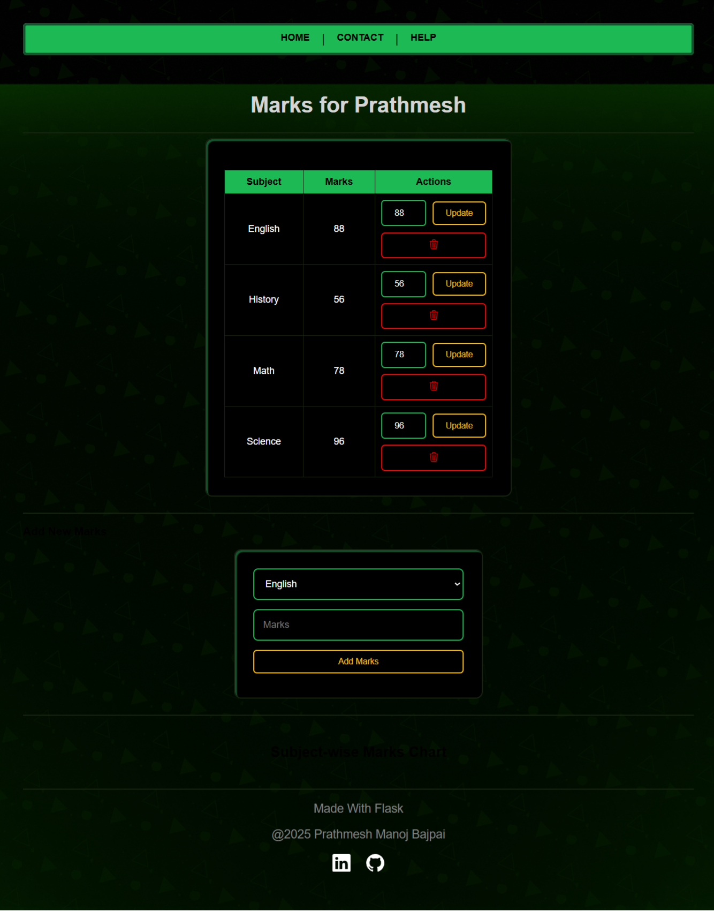

# Student Database Management System (Flask + MySQL)

A web-based Student Result Management System built using **Flask** and **MySQL** that allows users to add students, assign marks, and view data in a tabular and graphical format.

---

## Features

This project is designed to demonstrate mastery of SQL CRUD operations using Flask, MySQL, MySQL Workbench, HTML and CSS.

---

Create:
 - Add new student records and their subject-wise marks to the database

Read:
  - View all students and their marks, both in tabular and graphical format

Update:
  - Edit student information and update marks for individual subjects

Delete:
  - Remove student entries and specific marks from the system

📊 Graphical Analysis:
  - View student marks as bar charts using Chart.js

MySQL Integration:
  - Robust backend connected with relational DB and foreign keys

Clean UI:
  - Frontend built using Bootstrap for responsiveness and clarity

Deployment Ready:
  - Runs locally with full DB support and deployable (Render-safe fallback logic)

---

## 📷 Screenshots

### 🏠 Home Page

### 📋 Student List

### ✏️ Student edit

### 📊 Marks Chart View & Edit

---

## 🎬 Video Demo

▶️ [Click to Watch Demo on YouTube](https://youtu.be/zaM3BoTpZdQ)

## 🛠 Tech Stack

- **Frontend**: HTML, CSS, Jinja2
- **Backend**: Python (Flask)
- **Database**: MySQL
- **Libraries**: Flask-MySQLdb, Chart.js

---

### 🔧 Setup Instructions 

1. **Clone the repository**
   Download or clone the project files from your GitHub repository to your computer.

2. **Navigate to the project folder**
   Open the project folder in your terminal or code editor.

3. **Create a virtual environment**
   Set up a virtual environment to manage your Python dependencies. If you're on Windows, you can do this by running `python -m venv venv`, and then activating it using `venv\Scripts\activate`.

4. **Install the required libraries**
   Once your virtual environment is activated, install the required packages using the command:
   `pip install -r requirements.txt`

5. **Set up MySQL**
   Make sure MySQL is installed and running on your system.
   Log in to MySQL and create a new database named `students_flaskproj`.

6. **Create the tables**
   Inside the new database, create the following tables manually using your MySQL client (like MySQL Workbench or phpMyAdmin), or run an SQL script file if provided.

7. **Configure credentials**
   In your `main.py` file, make sure the MySQL username, password, host, and database name are correctly set.

8. **Run the Flask app**
   Start the Flask server by running `python main.py`.
   You’ll see a message saying the app is running on `http://127.0.0.1:5000`.

9. **Open the app in your browser**
   Go to that URL in your browser. You’ll see the homepage of your Student Result Management System.

10. **Try out the features**
    You can now add students, edit their information, assign marks, and view charts. All of this is connected to your MySQL database.

---

## 👩‍💻 Authors

**Prathmesh Manoj Bajpai**  
[LinkedIn](https://www.linkedin.com/in/prathmesh-bajpai-8429652aa/)

